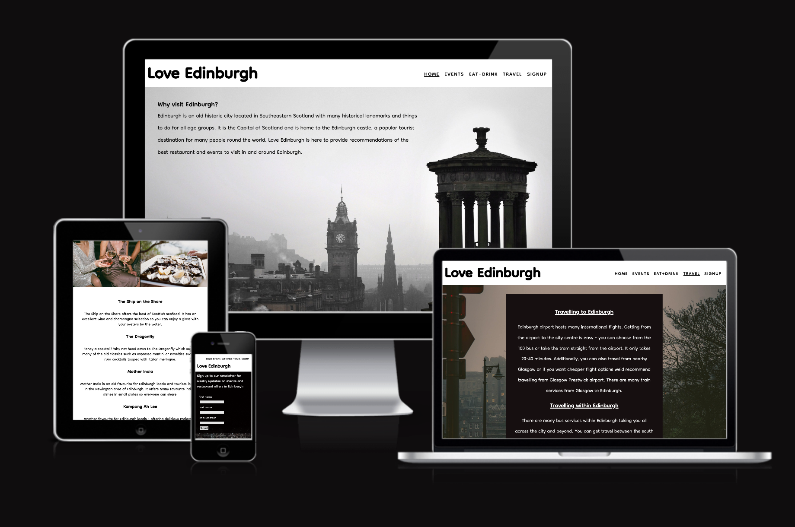
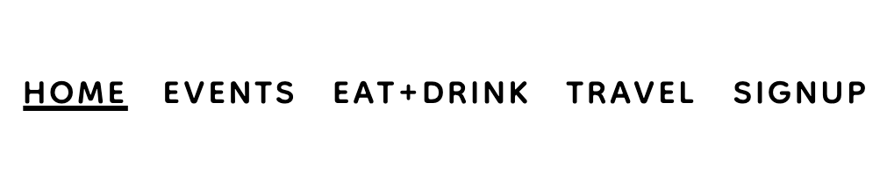
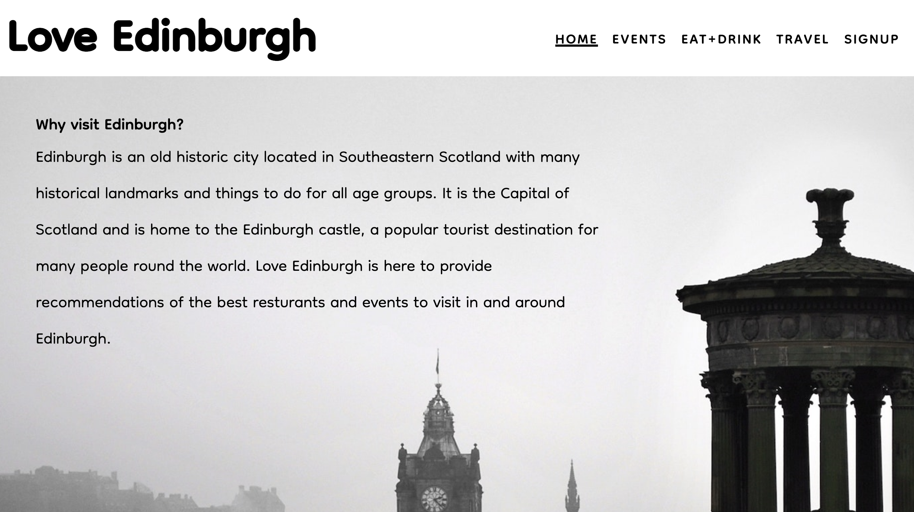
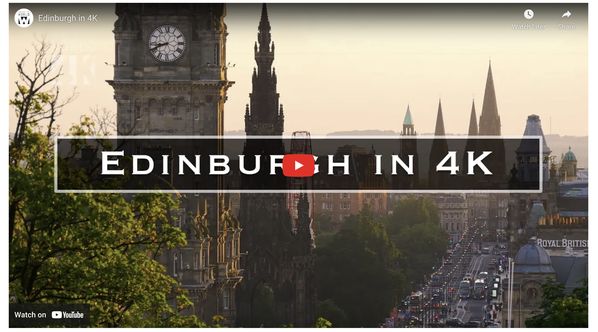
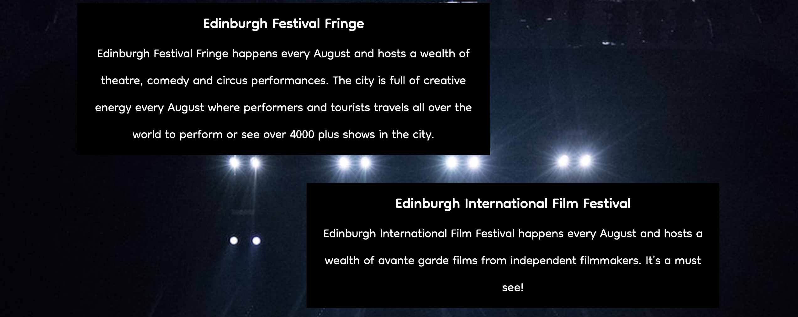
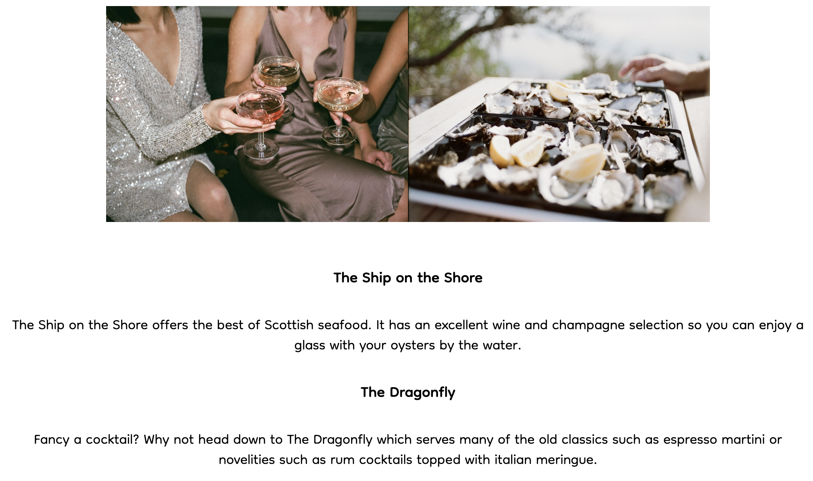
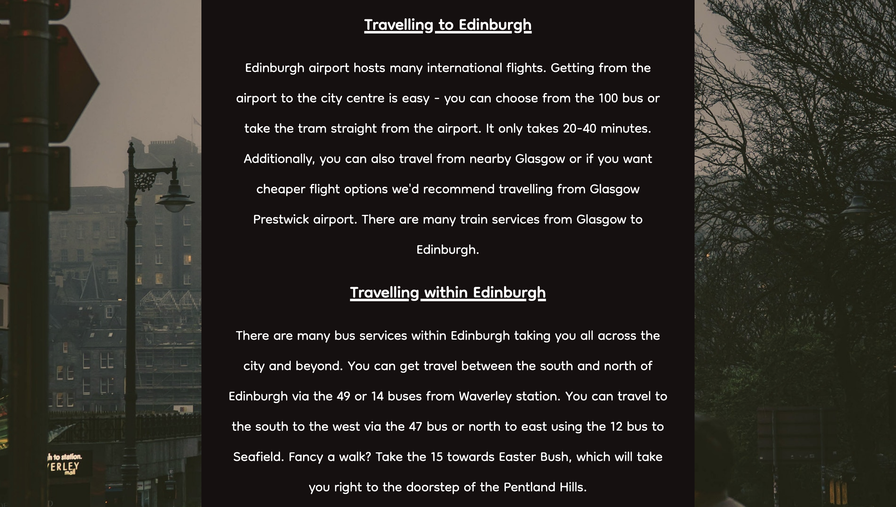
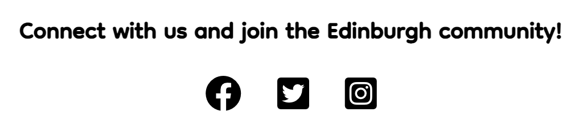
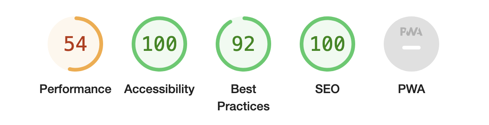

# **Love Edinburgh** #
 
Love Edinburgh is an Edinburgh tourist site which offers information on key events, restaurants and travel advice for visitors to Edinburgh. Edinburgh is a popular tourist destination for people around the world with a wealth of restaurant and events choices. Love Edinburgh provides the key events and best restaurants to visit in Edinburgh.
 
This project is built for the purpose of the milestone project 1 submission for Code Institute full stack software development diploma.

 
Site can be found [here](https://bgcg.github.io/project1/).
 
## **UX** ##
 
### **Site purpose** ###
 
To provide event and restaurant information about Edinburgh, as well as travel advice. Due to it's connection with a fictional social media group "Love Edinburgh", it provides a means for those new to Edinburgh to connect with tourists or new residents to Edinburgh. Site visitors can also sign up to a fictional newsletter to receive live updates of Edinburgh events, restaurant offers and travel advice.
 
### **Audience** ###
 
The site is directed to those that would like, are about to or are new to Edinburgh and unsure of what is the key events/restaurants to visit and how to travel around Edinburgh.
 
### **Responsive Design** ###
 
This website is built with responsive design in mind to effectively respond to the user's choice of device such as smartphone, tablet, laptop and larger desktop screen sizes using conditional media queries. The website is targeted to a number of device sizes such as iPhone SE, iPad mini and Galaxy Fold in addition to laptop and desktop viewing.
 
### **Accessibility** ###
 
The website HTML code includes aria-labels for social media links and alt labels for HTML images. All images inputed using CSS (as are the images on the Home, Events and Signup page) are for decorative purposes only.
 
### **Communication** ###

The website is presented with bold soft text for the headers to distinguish from paragraph elements. Usage of contrasting white text against black background or dark text against white or gray background to provide optimal contrast for readability. 
 
### **Current user goals** ###
 
* To see updates on events and restaurants in Edinburgh.
 
### **New user goals** ###
 
* To navigate through the site with ease.
* To gain events, restaurant and travel advice about Edinburgh.
* To be able to sign up to a newsletter if they wish to receive live updates on events and restaurant offers.
 
## **Design** ##
 
### **Color scheme** ###
 
The site has a dark and amber color theme to represent the often foggy weather of Edinburgh in Winter or the golden Autumn season in Edinburgh. As Edinburgh hosts a wealth of events, dark tones are also used to represent the atmosphere of the theatre and music concerts.
 
### **Imagery** ###
 
The imagery used was to reflect the beautiful scenery scene from the Edinburgh skyline (as with the homepage) or from Princes street (travel page). The site also contains imagery reminiscent of those you would see at the Edinburgh Fringe festival (events page) and Edinburgh music festivals (signup page), as well as the kind of restaurants or bar experiences in Edinburgh (eat+drink page).
 
### **Typography** ###
 
Dongle font from Google Fonts was used throughout the website which is a sans serif font. I used this due to its soft display, ease of readability and informal, welcoming nature. From Google Fonts, I also downloaded all the font weights/styles of Dongle to distinguish the logo from the main content of the page and to place emphasis on the navigation bar to improve readability on smaller screen sizes.
 
## Features ##
 
**Logo:**
* Each page contains a 'Love Edinburgh' logo with a clickable link that takes you back to the home page if you travel to a different page.
 

 
**Navigation menu:**
 
* Each page contains a navigation menu in an intuitive place (top right hand corner of the page) and when you hover over the links they turn from black to gray.
* In the navigation bar, the active page will also be underlined so the user knows which page they are on.
 

 
**Homepage:**
 
* The home page has a decorative image of a view of Edinburgh skyline looking down on the Princes street (the main street in Edinburgh) with text overlayed stating reasons to visit Edinburgh and an introduction to what the site can offer.
* When you scroll down the page there is a welcome video of Edinburgh from youtube that gives a taster of what Edinburgh can offer.
 

 
**Events page:**
 
* The events page lists the key events that Edinburgh hosts such as the Edinburgh Fringe festival, the Edinburgh International Film Festival, the Edinburgh International Book Festival and the various music festivals in and around Edinburgh.
* The idea is that this page would have updates on events in and around Edinburgh where users can revisit.
 

 
**Eat+Drink page:**
 
* Images of the type of restaurant experience you may have in Edinburgh.
* The next page is an eat+drink page offering information on some of the best Edinburgh eats. These are real Edinburgh restaurants that are popular spots in Edinburgh.
 

 
**Travel advice page:**
 
* This is followed by a travel advice page which offers general advice on how to get to Edinburgh via plane.
* The travel page also provides information on how to get around Edinburgh by bus.
 

**Signup page:**

* The last page is a newsletter sign up page where users can sign up to a fictional newsletter to receive live updates on events and restaurant offers in Edinburgh.
* As this newsletter is fictional, submission of details will take the user to the Code Institute formdump page.

 
**Social media links:**
 
* Social media links are provided at the footer of each page for a fictional social media account 'Love Edinburgh' which provides regular live updates of events and offers in Edinburgh.
* Additionally, the social media links adds a community connection to other tourists and locals in Edinburgh.
 

 
 
## Testing ##
 
### **Troubleshooting and Optimisation** ###
 
My main areas which required much optimisation and testing was when coding the responsive design queries - especially to code the navigation bar so it would still be readable on small screens. I found on smaller screen sizes the navigation bar was distorted and at certain screen widths disappeared behind other content at small screens sizes (especially 280px max screen width for Galaxy Fold devices). I found wrapping the logo and navigation bar in a container and setting `display` to `inline-block` helped. Then I made the logo and menu their own separate divs inside the nav-logo container. Then I fixed the position of the menu using `top:0;` `left:0` and `position: absolute;` I would have liked to code a dropdown navigation bar, however I struggled due to time constraints but will definitely consider this option in future projects. I tested the responsive code by selecting each device display in the Google Dev tools, selecting 100% zoom and ensuring readability and conformance of elements in the website.

On smaller screen sizes, the main changes I have made is to decrease the line spacing of p elements and make the div elements cover the background images rather than have a small margin in larger screens. In the responsive design for smartphones and iPads, the form element has the label on top of the input boxes rather than beside. All these changes are to enhance the readability of the text on smaller devices.
 
Previously I had headers for the events and eat+drink page, 'Events in Edinburgh' and 'Edinburgh food and drink', respectively, but I found them difficult to control in the responsive design process - often being misplaced on smaller screens and the start of the page looking a bit 'text heavy' without the extra space that you have on larger screens. I opted instead to get rid of the headings and instead underline the active pages in the navigation bar so the user knows which page they are viewing. I used the `text-decoration:underline;` as for an unknown reason the border-bottom the line was placed awkwardly low in respect to the navigation bar. Although I have no stylistic control when using the `text-decoration: underline;` I thought this was the best option in this circumstance. At first it didn't work when I wrote `.active {text-decoration: underline}`. Then I realised due to the CSS hierarchy I would have to first target the menu id selector followed by the active class selector - `#menu .active{text-decoration: underline}`.
 
On the eat+drink page I wanted to align the two images side by side as initially they were in a column when using `display:inline-block`. I wrapped the images in a container with their own separate div's insides and used `display: flex;` on the container which gave the desired effect. I found this [video](https://www.youtube.com/watch?v=JtR2XKFj9tQ) by Cem Eygi Media very helpful in troubleshooting this issue.
 
### **Key testing points** ###
 
* I have tested this site works on Google Chrome, Microsoft Edge, Safari and Firefox.
 
* I have confirmed that the site is responsive to multiple screen widths using the devtools device toolbar.
 
* I have confirmed that when I enter details into the form on the sign up page that the form works and takes the page to the Code Institute formdump as intended and the email input only accepts an email address.
 
* I have confirmed the social media and navigations links work and take the user to the page or website, respectively.
 
* I have confirmed that the header, navigation bar and main content on each of the pages is visible.
 
### **Validators** ###
 
* The W3C CSS validation service was used and no errors were found.
 
* The W3C HTML validation service was used and no errors were found.
 
* Lighthouse report output showed an excellent accessibility score. Below I have presentated a sreenshot from the homepage lighthouse report (as I am unaware how to perform audit on the whole website). I performed the lighthouse audit on all pages scored and they all scored an accessibility score of 100%.

 
### **Bugs** ###
 
* All bugs detected have been fixed. There was a couple of occassions where images weren't showing up on the website where I found due to the wrong directory or file name being inputed into `src` or `background:url()` (classsic mistake!). All other bug resolutions are described in the testing section of this readme. 
 
## Deployment ##
 
This project is hosted using Github pages by executing the following steps;
 
* Go to settings on the Github repository.
* Click on pages.
* Set branch to 'main'.

Site can be found [here](https://bgcg.github.io/project1/).
 
## Technologies used ##
 
### **Languages** ###
 
* HTML
* CSS
 
### **Programs, libraries and frameworks used** ###
 
* GitHub - The internet hosting site github.com to host this website
* Gitpod - Gitpod developer platform was used to code my website and then was pushed to github
* Google fonts - Dongle font was used throughout this site which was downloaded from Google Fonts
* fontawesome - The facebook, Instagram and Twitter icons are from fontawesome.com
* Am I responsive? - the screenshot in the introduction section was from https://ui.dev/amiresponsive
* Google developer tools - to check responsiveness of website design
* Google color picker - I usued the Google color picker to find HEX codes for the desired colours used in this website
 
## Credits ##
 
### **Content** ###
 
Due to my beginner experience in web development, aspects of this project were loosely based on the Code Institute Love Running project - in particular the header and footer elements. I did code the headers and footers from memory but then revisited the Love Running project walkthrough to ensure I hadn't forgotten anything (which I hadn't). In terms of specific code taken from the Love Running project, I have used the wildcard margin and padding code, in order to improve control of content positioning.

I found the stack overflow reply written by [Red Zephyr Design and Terry](https://stackoverflow.com/questions/15042986/bootstrap-responsive-css-image-width-skewed-and-distorted) useful to remind me how to resize images so they will not be distorted on smaller or larger screen sizes or simply positioned correctly in normal screen sizes. I found the `height: auto;` and `background-size: contain;` useful.
 
[The display W3 schools page](https://www.w3schools.com/cssref/pr_class_display.asp) was helpful in reminding me of all the display parameters I can use and their meaning.
 
I had some difficulties aligning the labels in the form element to the inputs - I found the reply from [Byron](https://stackoverflow.com/questions/4309950/how-to-align-input-forms-in-html) on Stack Overflow really helpful, who suggested to use display: in-line-block; to the label in CSS to align the label with the input element.

When aligning the logo and navigation bar I found the reply from [Adam Grant](https://stackoverflow.com/questions/14104599/problems-aligning-my-logo-with-the-navigation-bar) useful. Although I didn't follow the exact advice recommended, I took inspiration from wrapping the logo and nav bar in their own container and then wrapped the logo and container gave better control of the positioning.

The [video](https://www.youtube.com/watch?v=JtR2XKFj9tQ) by Cem Eygi Media was helpful in troubleshooting the image positioning on the eat and drink page as discussed in the testing section.

For the navigation bar troubleshooting where I fixed the position of the nav bar eventually so it would 'fly around' on smaller screens I took inpiration from the following [stack overflow post](https://stackoverflow.com/questions/14390979/how-do-i-keep-a-nav-bar-at-the-top-of-the-page#:~:text=Use%20position%20absolute%20and%20set,the%20top%20of%20the%20browser). I am incredibly grateful to those who contributed to this post as this was an ongoing issue!
 
### **Media** ###
 
#### Images ####
 
All images used are from pexels.com which offers royalty-free images. Thank you pexels.com! Specific credits for images;
 
* homepage hero image: [Pixabay](https://www.pexels.com/photo/silhouette-of-big-ben-surrounded-by-fog-during-daytime-161863/)
 
* events page background image: [Wendy Wei](https://www.pexels.com/photo/silhouette-photography-of-people-on-theater-1714361/)
 
* eat+drink page (girls and champagne image): [Inga Seliverstova](https://www.pexels.com/photo/woman-in-silver-v-neck-long-sleeved-dress-3394310/)
 
*eat+drink page (Oysters image: [sl wong](https://www.pexels.com/photo/selective-focus-photo-of-oysters-ceramic-tray-3534584/)
 
* Travel advice page background image: [Danila Giancipoli](https://www.pexels.com/photo/three-person-crossing-streets-2242170/)
 
* signup/newsletter page background image: [Wendy Wei](https://www.pexels.com/photo/photo-of-live-concert-1540372/)
 
Licencing information for pexels.com can be found [here](https://www.pexels.com/license/).
 
#### Social media icons ####
 
Social media icons are from fontawesome.com (thank you!).
 
Licencing information for fontawesome.com can be found [here](https://fontawesome.com/license).
 
#### Video ####
 
Credits for video on home page; Video created by [Around The World 4K](https://www.youtube.com/watch?v=SRNyfBRhq0A). The video was inserted by right clicking on the video and selecting 'Copy embed code' and pasting this into the desired place in the index.html file.
 
#### People ####
 
Thank you to my mentor for providing valuable feedback.

