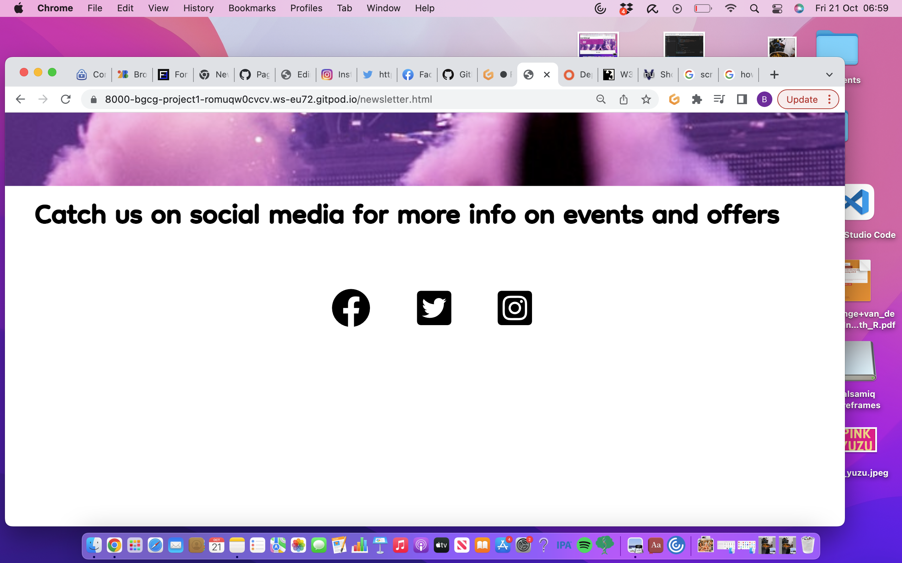

This is a tourist site for Edinburgh which offers information on key events, resturants and travels advice for visitors to Edinburgh.

The project is still under development. 

This website is built using HTML, CSS and some Javascript from fontawesome.com 

All images used are from pexels.com which offers royality-free images. Thank you pexels.com!

Specific credits for images;

I have cited the original file names of the images which I believe contains the name or username of the photographer who shared the photo on pexels;

index.html page / hero image: pexels-pixabay-161863

todo.html page background image: pexels-wendy-wei-1714361

Eat page images (from the left) - 
Laska soup image: pexels-amanda-lim-9772442
Girls and champagne image: pexels-inga-seliverstova-3394310
Oysters image: pexels-sl-wong-3534584

Travel adive page background image: pexels-danila-giancipoli-2242170

form.html image: pexels-wendy-wei-1190298

Social media icons are from fontawesome.com (thank you!)

Licencing information - 
https://www.pexels.com/license/
https://fontawesome.com/license

Credits for video on home page;
https://www.youtube.com/watch?v=SRNyfBRhq0A (user acccount name: Around The World 4K)

This website will be built with reponsive design in mind to effectively respond to the users choice of device.

This project will be hosted using github pages. 

This project is built for the purpose of the milestone project 1 submission for code institute full stack software development diploma.

The structure of this website is a home page with reasons to visit Edinburgh.

 This is follow by a welcome video from youtube.
 
 On the next page describes key events going on in Edinburgh.
 
The next page is an eat+drink page offering information on some of the best Edinburgh eats.

This is followed by a travel advice page which offers general advice on how to get to and around Edinburgh and a fictional newsletter page where those who wish to recieve regular events and resturant offers can do so. 

Social media links are provided at the footer of each page for a fictional social media account "Love Edinburgh" which provides regular live updates of events and offers in Edinburgh, as well as adding a community connection to other tourists and locals in Edinburgh. 

Each page contains a navigation menu in a intuitive place (top left hand corner of the page) and also the user can click on the "Love Edinburgh" icon on the top-left of each page to return to the home page. 

Thank you to my mentor :)