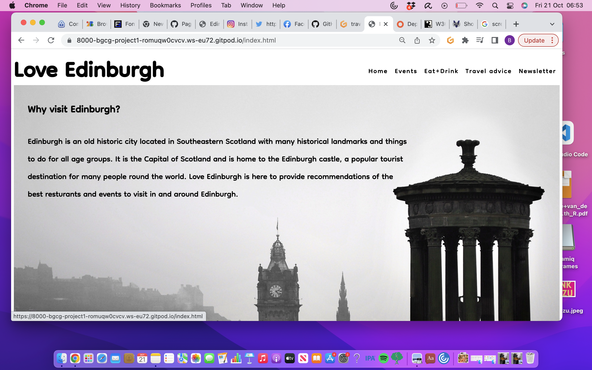
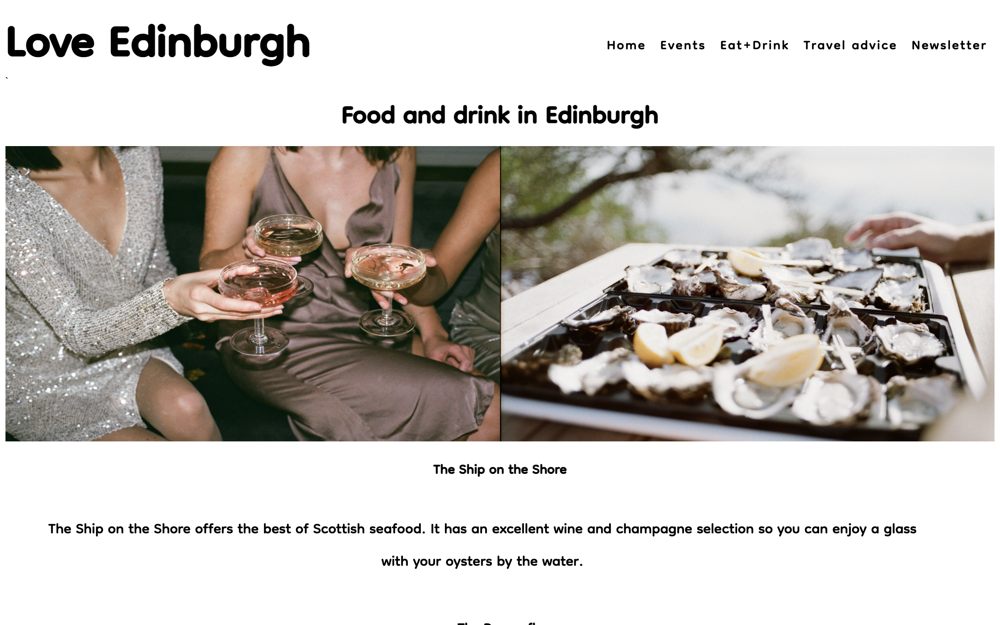
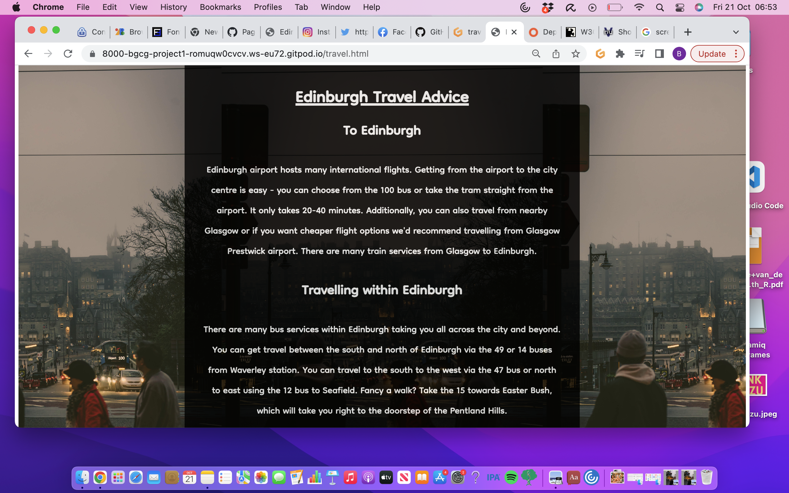
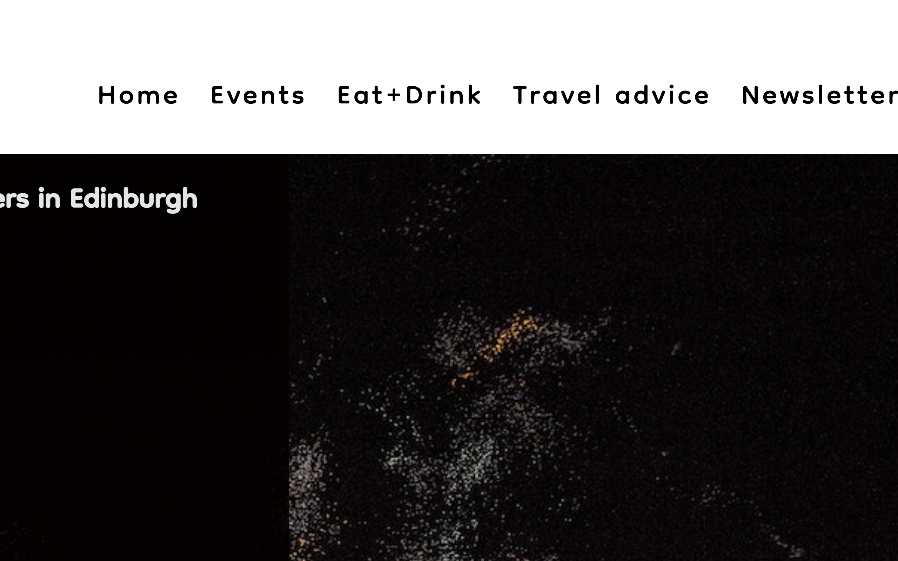

Love Edinburgh is a tourist site for Edinburgh which offers information on key events, resturants and travels advice for visitors to Edinburgh. Edinburgh is a popular tourist destination for people around the word with a wealth of resutrant and events choices. Love Edinburgh provides the fundanmental key events and best (within budget) resturants to visit in Edinburgh. 

This project is built for the purpose of the milestone project 1 submission for code institute full stack software development diploma. The project is still under development. 

Site can be found here (!insert link to git hub pages here!)

**Table of contents**

**UX**

*Site purpose*

To provide event and resturant information about Edinburgh, as well as travel advice. Due to it's connection with a fictional social media group "Love Edinburgh", it provides a means for those new to connect with tourists or new residents to Edinburgh and also recieve live updates of Edinburgh events, resturant offers and travel advice. 

*Audience*

The site is directed to those that would like, are about to or are new to Edinburgh and unsure of what is the key events/resturants to visit and how to travel around Edinburgh. 

The website has a site logo at the top left hand side which is clickable to take you back to the homepage if you travel to another page. It has a navigation bar on the right, where the color of the links will change from black to grey. 

*Responsive design*

This website is built with reponsive design in mind to effectively respond to the users choice of device such as smartphone, tablet, laptop and larger destop screen sizes using conditional media queries. The website is targeted to a number of device sizes such as iPhone SE, iPad mini and galaxy fold in addition to laptop and destop viewing. 

*Accessibility*

The website html code includes aria-labels for social media links and also alt labels for html images as well as aria-labels for CSS inputed images inserted into the div elements they are associated with by id selectors. 

**Design**

*Color scheme* 

The site has a dark and amber color theme to represent the often foggy weather of Edinburgh in Winter or the golden Autum season in Edinburgh. As Edinburgh host a lot of events, dark tones are also used to respresent the atmosphere of the theatre and music conserts. 

*Imagery* 

The imagery used was to reflect the beautiful scenery scene from the Edinbugh skyline (as with the homepage) or from Princes street (travel advice page). The site also contains imagery reminisent of those you would see at the Edinburgh festival (events page) and music festivals (newsletter), as well as the kind of resturants or bar experiences in Edinburgh (eat+drink page).

*Typography*

Dongle font from google fonts was use throughout the website which is a sans serif font. I used this due to it's soft display, ease of readability and informal, welcoming nature. 

**Communication**
 
The website is presented with bold soft text for the headers to distinguish from paragraph elements. Usage of contrasting white text against black bacground or dark text against white or gray background to provide optimal constrast for readability.  

**Current user goals**

To see updates on events and resturants in Edinburgh.

**New user goals**

To navigate through the site with ease.
To gain events, resturant and travel advice about Edinburgh.
To be able to sign up to a newsletter if they wish to recieve live updates on events and resturant offers.

**Features**

The structure of this website is a home page with reasons to visit Edinburgh.

 This is follow by a welcome video from youtube.
 
 On the next page describes key events going on in Edinburgh.
 
The next page is an eat+drink page offering information on some of the best Edinburgh eats.

This is followed by a travel advice page which offers general advice on how to get to and around Edinburgh and a fictional newsletter page where those who wish to recieve regular events and resturant offers can do so. 

Social media links are provided at the footer of each page for a fictional social media account "Love Edinburgh" which provides regular live updates of events and offers in Edinburgh, as well as adding a community connection to other tourists and locals in Edinburgh. 

Each page contains a navigation menu in a intuitive place (top left hand corner of the page) and also the user can click on the "Love Edinburgh" icon on the top-left of each page to return to the home page. 

**Testing**

*Validators* 

The W3C CSS validation service was used and no errors were found.

The W3C html validation service was used and no errors were found.

Lighthouse report output showed an excellent accessibility score. 

*Bugs*

All bugs detected have been fixed.

**Deployment**

This project will be hosted using github pages. 

**Technologies used**

*Languages*

HTML
CSS

*Programs, libraries and frameworks used*

Gitpod
GitHub
Google fonts
fontawesome
Am I responsive? 

**Credits**

*Content* 

Opacity hover effects of div elements on events page was taken from inpiration from the w3 schools page - 
https://www.w3schools.com/css/css_image_transparency.asp

Fixing image resizing and destortion in responsive design - I found this stack overflow reply useful to remind me how to resize images so they will not be distored on smaller or larger screen sizes or simply positioned correctly in normal screen sizes - https://stackoverflow.com/questions/15042986/bootstrap-responsive-css-image-width-skewed-and-distorted
I found the 'height: auto' and 'background:contain' useful. 

This W3 school page was helpful in reminding me of all the display parameters I can use and there meaning - https://www.w3schools.com/cssref/pr_class_display.asp

Love running project - 

*Media*

All images used are from pexels.com which offers royality-free images. Thank you pexels.com! Specific credits for images where I have cited the original file names of the images which I believe contains the name or username of the photographer who shared the photo on pexels;

index.html page / hero image: pexels-pixabay-161863

todo.html page background image: pexels-wendy-wei-1714361

Eat page images (from the left) - 
Girls and champagne image: pexels-inga-seliverstova-3394310
Oysters image: pexels-sl-wong-3534584

Travel adive page background image: pexels-danila-giancipoli-2242170

form.html image: pexels-wendy-wei-1540372

Social media icons are from fontawesome.com (thank you!)

Licencing information - 
https://www.pexels.com/license/
https://fontawesome.com/license

*Video*

Credits for video on home page;
https://www.youtube.com/watch?v=SRNyfBRhq0A (user acccount name: Around The World 4K)

Thank you to my mentor :)