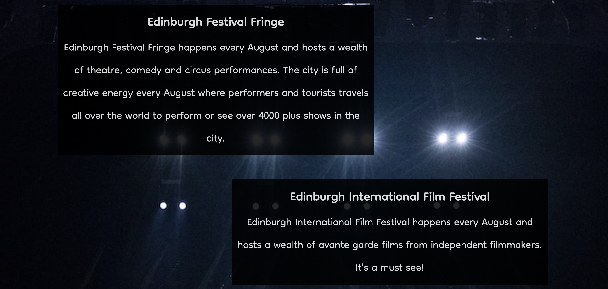

# **Love Edinburgh** #

Love Edinburgh is a tourist site for Edinburgh which offers information on key events, resturants and travels advice for visitors to Edinburgh. Edinburgh is a popular tourist destination for people around the word with a wealth of resutrant and events choices. Love Edinburgh provides the fundanmental key events and best resturants to visit in Edinburgh. 

This project is built for the purpose of the milestone project 1 submission for code institute full stack software development diploma. The project is still under development. 

Site can be found [here](https://bgcg.github.io/project1/).

## **UX** ##

### **Site purpose** ###

To provide event and resturant information about Edinburgh, as well as travel advice. Due to it's connection with a fictional social media group "Love Edinburgh", it provides a means for those new to Edinburgh to connect with tourists or new residents to Edinburgh. Site visitors can also sign up to a fictional newsletter to receive live updates of Edinburgh events, resturant offers and travel advice. 

### **Audience** ###

The site is directed to those that would like, are about to or are new to Edinburgh and unsure of what is the key events/resturants to visit and how to travel around Edinburgh. 

### **Responsive Design** ###

This website is built with reponsive design in mind to effectively respond to the users choice of device such as smartphone, tablet, laptop and larger destop screen sizes using conditional media queries. The website is targeted to a number of device sizes such as iPhone SE, iPad mini and galaxy fold in addition to laptop and destop viewing. 

### **Accessibility** ###

The website HTML code includes aria-labels for social media links and also alt labels for HTML images as well as aria-labels for CSS inputed images inserted into the div elements they are associated with by id selectors. 

### **Communication** ###
 
The website is presented with bold soft text for the headers to distinguish from paragraph elements. Usage of contrasting white text against black background or dark text against white or gray background to provide optimal constrast for readability.  

### **Current user goals** ###

* To see updates on events and resturants in Edinburgh.

### **New user goals** ###

* To navigate through the site with ease.
* To gain events, resturant and travel advice about Edinburgh.
* To be able to sign up to a newsletter if they wish to recieve live updates on events and resturant offers.

## **Design** ##

### **Color scheme** ###

The site has a dark and amber color theme to represent the often foggy weather of Edinburgh in Winter or the golden Autum season in Edinburgh. As Edinburgh hosts a wealth of events, dark tones are also used to respresent the atmosphere of the theatre and music conserts. 

### **Imagery** ###

The imagery used was to reflect the beautiful scenery scene from the Edinbugh skyline (as with the homepage) or from Princes street (travel advice page). The site also contains imagery reminisent of those you would see at the Edinburgh Fringe festival (events page) and Edinburgh music festivals (newsletter), as well as the kind of resturants or bar experiences in Edinburgh (eat+drink page).

### **Typography** ###

Dongle font from Google Fonts was use throughout the website which is a sans serif font. I used this due to it's soft display, ease of readability and informal, welcoming nature. From Google Fonts, I also downloaded all the font weights/styles of Dongle to distinguish the logo from the main content of the page and to place emphasis on the navigation bar to improve readability on smaller screen sizes. 

## Features ##

**Logo:** 
* Each page contains a 'Love Edinburgh' logo with a clickable links that takes you back to the home page if you travel to a different page. 

 

**Navigation menu:**

* Each page contains a navigation menu in an intuitive place (top right hand corner of the page) and when you hover over the links they turn from black to gray. 
* In the navigation bar, the active page will also be underlined so the user knows which page they are on. 

 

**Homepage:** 

* The home page with a decorative image of a view of Edinburgh skyline looking down on the Princes street with text overlayed stating reasons to visit Edinburgh and an introduction to what the site can offer. 
* When you scroll down the page there is a welcome video of Edinburgh from youtube that gives a taster of what Edinburgh can offer.

 **Events page:**

* The events pages lists the key events that Edinburgh hosts such as the Edinburgh Fringe festival, the Edinburgh International Film Festival, the Edinburgh International Book Festival and the various music festivals in and around Edinburgh. 
* The idea is that this page would have updates on Events in and around Edinburgh where users can revisit. 

 

 **Eat+Drink page:**

* Images of the type of resturant experience you may have in Edinburgh. 
* The next page is an eat+drink page offering information on some of the best Edinburgh eats. These are real Edinburgh resturants that are popular spots in Edinburgh.

**Travel advice page:**

* This is followed by a travel advice page which offers general advice on how to get to Edinburgh via plane 
* The travel page also provides information on how to get around Edinburgh by bus.

**Social media links:** 

* Social media links are provided at the footer of each page for a fictional social media account 'Love Edinburgh' which provides regular live updates of events and offers in Edinburgh. 
* Additionally, the social media links adds a community connection to other tourists and locals in Edinburgh. 

## Testing ##

### **Troubleshooting and Optimisation** ###

My main areas which required much optimisation and testing was when coding the repsonsive design queries - especially to code the navigaion bar so it would still be readable on small screens. I found on smaller screen sizes the navigation bar was distorted and at certain screen widths disapeared behind other content at small screens sizes (especially 280px max screen width for Galaxy Fold devices). I found wrapping the logo and navaigation bar in a container and setting `display` to `inline-block` helped. Then I made the logo and menu their own seperate div's inside the nav-logo container. I would have liked to code a dropdown navigation bar, however I struggled due to time contraints but will definitely consider this option in future projects. 

Previously I had headers for the events and eat+drink page, 'Events in Edinburgh' and 'Edinburgh food and drink', respectively, but I found them difficult to control in the responsive design process - often being misplaced on smaller screens and the start of the page looking a bit 'text heavy' without the extra space that you have on larger screens. I opted instead to get rid of the headings and instead underline the active pages in the navigation bar so the user knows which page they are viewing. I used the `text-decoration:underline;` as for an unknown reason the border-bottom the line was placed awkwardly low in respect to the navigation bar. Although I have no stylistic control when using the `text-decoration: underline;` I thought this was the best option in this circumstance. At first it didn't work when I wrote `.active {text-decoration: underline}`. Then I realised due to the CSS heirachy I would have to first target the menu id selector followed by the active class selector - `#menu .active{text-decoratoion: underline}`.

On the eat+drink page I wanted to align the two images side by side as intially they were in a column when using `display:inline-block`. I wrapped the images in a container with their own seperate div's insides and used `display: flex;` on the container which gave the desired effect. I found this [video](https://www.youtube.com/watch?v=JtR2XKFj9tQ) by Cem Eygi Media very helpful in troubleshooting this issue. 

### **Key testing points** ### 

* I have tested this site works on Google Chrome, Microsoft Edge, Safari and Firefox.

* I have confirmed that the site is responsive to multiple screen widths using the devtools device toolbar.

* I have confirmed that when I enter details into the form on the sign up page that the form works and takes the page to the Code Institute formdump as intended and the email input only accepts an email address.

* I have confirmed the social media and navigations links work and take the user to the page or website, respectively.

* I have confirmed that the header, navigation bar and main content on each of the pages is visible.

### **Validators** ###

* The W3C CSS validation service was used and no errors were found.

* The W3C HTML validation service was used and no errors were found.

* Lighthouse report output showed an excellent accessibility score. 

### **Bugs** ###

* All bugs detected have been fixed.

## Deployment ##

This project is hosted using Github pages by executing the following steps;

* Go to settings on the Github repository.
* Click on pages.
* Set branch to 'main'.

## Technologies used ##

### **Languages** ###

* HTML
* CSS

### **Programs, libraries and frameworks used** ###

* GitHub - The internet hosting site github.com to host this website 
* Gitpod - Gitpod developer platform was used to code my website and then was pushed to github 
* Google fonts - Dongle font was used throughout this site which was downloaded from Google Fonts
* fontawesome - The facebook, Instagram and Twiiter icons are from fontawesome.com
* Am I responsive? - to check that website looks good across different devices

## Credits ##

### **Content** ###

Due to my beginner experience in web development, aspects of this project were loosely based on the Code Institute Love Runnning project - in particular the header and footer elements. Precisely, I have used the wildcard margin and padding code, also used in the Love Running project, in order to improve control of content positioning. 

Opacity hover effects of div elements on events page was taken from inspiration from [this w3 schools page](https://www.w3schools.com/css/css_image_transparency.asp). 

I found the stack overflow reply wriiten by [Red Zephyr Design and Terry](https://stackoverflow.com/questions/15042986/bootstrap-responsive-css-image-width-skewed-and-distorted) useful to remind me how to resize images so they will not be distorted on smaller or larger screen sizes or simply positioned correctly in normal screen sizes. I found the `height: auto;` and `background-size: contain;` useful. 

[The display W3 school page](https://www.w3schools.com/cssref/pr_class_display.asp) was helpful in reminding me of all the display parameters I can use and there meaning.

I had some difficulties aligning the labels in the form element to the inputs - I found the reply from [Byron](https://stackoverflow.com/questions/4309950/how-to-align-input-forms-in-html) on Stack Overflow really helpful, who suggested to use display: in-line-block; to the label in CSS to align the label with the input element.

Advice that I used for putting aira-label in div elements was found [here](https://stackoverflow.com/questions/40555111/what-is-the-best-way-to-use-a-background-image-on-a-div-yet-remain-accessible).

I had an issue with alignment of header and nav bar when I placed the logo above the nav bar in the html code. I resolved this issue from inspiration from reply from [Adam Grant](https://stackoverflow.com/questions/14104599/problems-aligning-my-logo-with-the-navigation-bar) in a stack overflow post.

### **Media** ###

#### Images ####

All images used are from pexels.com which offers royality-free images. Thank you pexels.com! Specific credits for images;

* homepage hero image: [Pixabay](https://www.pexels.com/photo/silhouette-of-big-ben-surrounded-by-fog-during-daytime-161863/)

* events page background image: [Wendy Wei](https://www.pexels.com/photo/silhouette-photography-of-people-on-theater-1714361/)

* eat+drink page (girls and champagne image): [Inga Seliverstova](https://www.pexels.com/photo/woman-in-silver-v-neck-long-sleeved-dress-3394310/)

*eat+drink page (Oysters image: [sl wong](https://www.pexels.com/photo/selective-focus-photo-of-oysters-ceramic-tray-3534584/)

* Travel adive page background image: [Danila Giancipoli](https://www.pexels.com/photo/three-person-crossing-streets-2242170/)

* signup/newsletter page bakground image: [Wendy Wei](https://www.pexels.com/photo/photo-of-live-concert-1540372/)

Licencing information for pexels.com can be found [here](https://www.pexels.com/license/).

#### Social media icons ####

Social media icons are from fontawesome.com (thank you!).

Licencing information for fontawesome.com can be found [here](https://fontawesome.com/license).

#### Video ####

Credits for video on home page; Video created by [Around The World 4K](https://www.youtube.com/watch?v=SRNyfBRhq0A). The video was inserted right clicking on the video and selecting 'Copy embed code' and pasting this into the desired place in the index.html file.

#### People ####

Thank you to my mentor for providing valuable feedback.